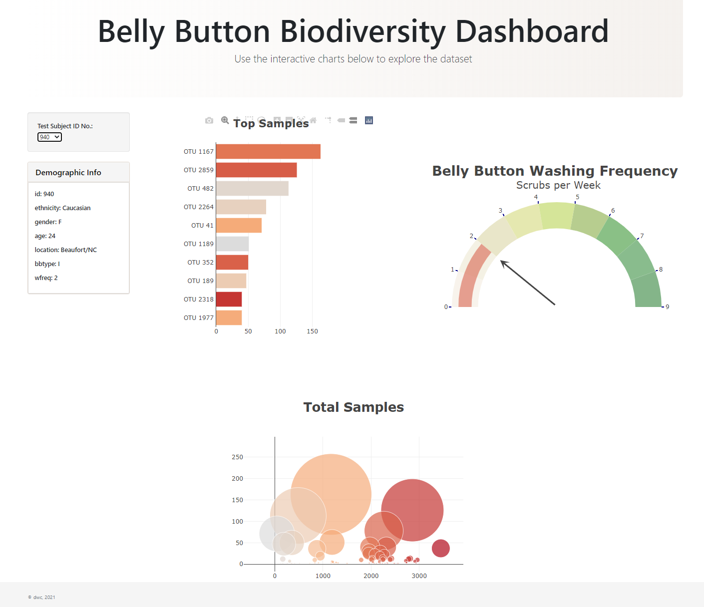

# Belly Button Diversity

An interactive dashboard to explore the Belly Button Biodiversity dataset, which catalogs the microbes that colonize human navels.

The dataset reveals that a small handful of microbial species (also called operational taxonomic units, or OTUs, in the study) were present in more than 70% of people, while the rest were relatively rare.

View preview here: <a href='https://rb25s13.github.io/Belly-Button-Biodiversity/'>https://rb25s13.github.io/Belly-Button-Biodiversity/</a> 

### Contents:

        /static - folders for js and css
                /css - style.css for custom styles
                /js - app.js for code to read and plot data

 

